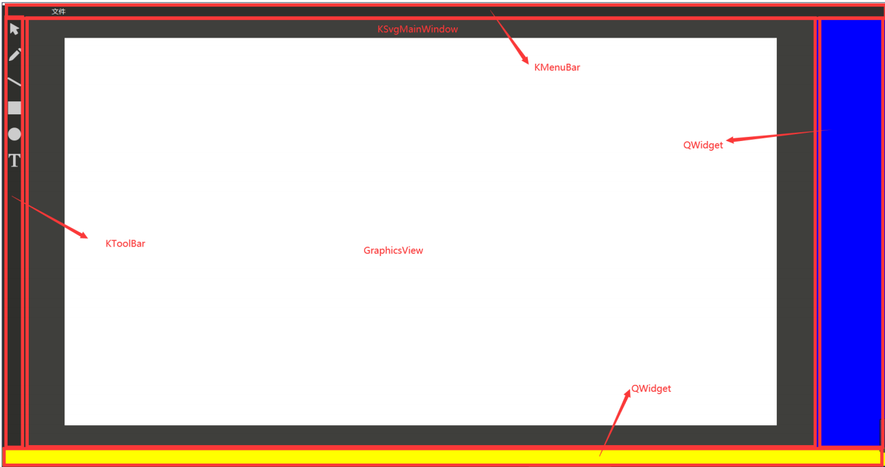
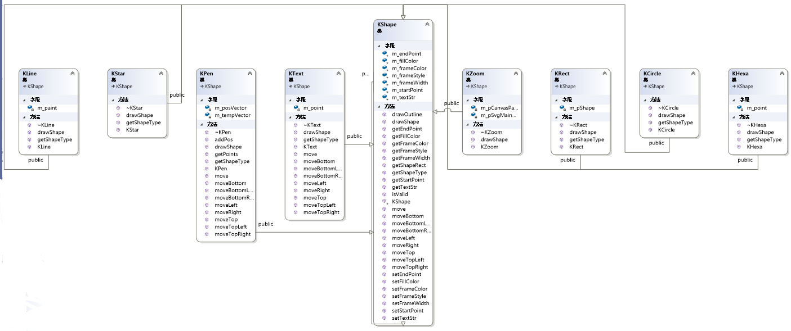
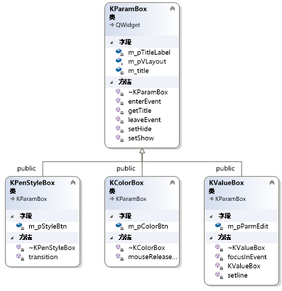
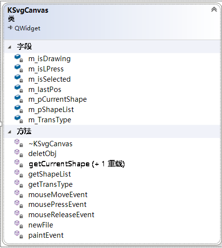
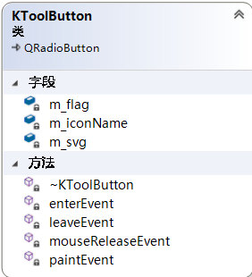
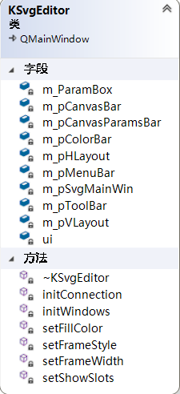
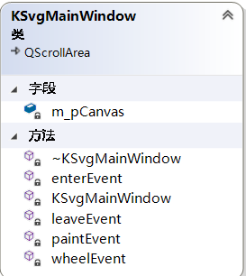
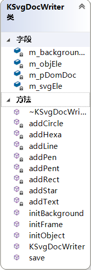

#                KSvgEditor-矢量图形编辑器

------

[TOC]

## 1.KSvgEditor项目结构介绍

### 1.1 KSvgEditor项目主要分为五个部分：

- KSvgCanvas：实现鼠标选择和拖动各类图形，储存画布中的图形
- KToolButton：实现图标的绘制和鼠标进入离开悬停的图标样式变化
- KSvgEditor：信号与槽函数的connect，初始化画布和功能块
- KSvgMainWindow：画布缩放与进出画布的鼠标变化功能
- KSvgDocWriter：保存画布为svg格式



### 1.2 实现思路

在本项目中实现svg矢量图形编辑器的思路主要是





## 2.各个部分详细介绍

### 2.1 KSvgCanvas



该模块的主要功能是：

- 设置画布的各项功能

```c++
	// 设置背景颜色为白色
	setStyleSheet("background-color:#FFFFFF");

	// 设置画布颜色
	KGlobalData::getGlobalDataIntance()->setCanvasColor("FFFFFF");

	// 设置画布大小
	resize(KGlobalData::getGlobalDataIntance()->getCanvasWidth(),
		KGlobalData::getGlobalDataIntance()->getCanvasHeight());

	//设置缩放比例
	KGlobalData::getGlobalDataIntance()->getCanvasScaling();
```

- 绘图

通过枚举类获取相应图形类中的画图事件（重写纯虚函数的作用）

```c++
void KSvgCanvas::paintEvent(QPaintEvent* event)
{
	
	if (!m_pShapeList->isEmpty())
	{
		for (QList<KShape*>::iterator it = m_pShapeList->begin();
			it != m_pShapeList->end(); ++it)
			(*it)->drawShape(this);//触发图形类中的绘制函数
	}

	if (m_pCurrentShape != NULL)
	{
		if (m_isDrawing) // 图形绘制标志为 true，则表示正在绘制该图形，此时需要不断重新绘制
			m_pCurrentShape->drawShape(this);

		if (m_isSelected) // 图形选中，则绘制选中框
			m_pCurrentShape->drawOutline(this);
	}
	return;
}
```


- 鼠标点击选择

使用枚举类找到选取的图形的种类，使用KShapeFactory::createShape函数找到当前图像的类

```c++
//鼠标点击事件
void KSvgCanvas::mousePressEvent(QMouseEvent* event)
{

	KGlobalData::KDrawFlag flag = KGlobalData::getGlobalDataIntance()->getDrawFlag();//获取图形类型

	if (flag == KGlobalData::KDrawFlag::NoneFlag)
		return;

	if (event->buttons() == Qt::LeftButton)
	{
		m_isLPress = true; // 记录鼠标左键已经点击

		//event->pos() : 你当前点击的位置
		m_pCurrentShape = getCurrentShape(event->pos());// 根据位置获取图形
		if (flag == KGlobalData::KDrawFlag::MouseFlag) // 如果是鼠标移动按钮选中
		{
			
			if (m_pCurrentShape != NULL)
			{
				emit setShowSignal(m_pCurrentShape);//发送显示信号

				m_lastPos = event->pos();// 当前位置作为移动的最开始位置
				m_isSelected = true; // 选中表示设置成功
				m_TransType = getTransType(event->pos()); // 获取移动类型
			}
			else
			{
				emit setHideSignal();//发送隐藏信号

				m_isSelected = false;
			}
		}
		else if (flag == KGlobalData::KDrawFlag::PenFlag)//自由线由于特性单独写
		{
			m_isSelected = false;
			m_pCurrentShape = KShapeFactory::createShape(KGlobalData::getGlobalDataIntance()->getDrawFlag());

			if (m_pCurrentShape != NULL)
				static_cast<KPen*>(m_pCurrentShape)->addPos(event->pos());
		}
		else// 如果是鼠标移动按钮没选中
		{
			
			m_isSelected = false;
			m_pCurrentShape = KShapeFactory::createShape(KGlobalData::getGlobalDataIntance()->getDrawFlag());
			if (m_pCurrentShape != NULL)
				m_pCurrentShape->setStartPoint(event->pos());
		}
	}
	update();//更新
}
```


- 鼠标移动

设置鼠标取焦不同位置所变化的形态

```c++
// 处理鼠标移动事件
void KSvgCanvas::mouseMoveEvent(QMouseEvent* event)
{
	KGlobalData::KDrawFlag flag = KGlobalData::getGlobalDataIntance()->getDrawFlag();

	if (flag == KGlobalData::KDrawFlag::NoneFlag)
		return;

	// 获取移动类型
	KTransType transType = getTransType(event->pos());

	// 如果已经选中
	if (m_isSelected
		&& flag == KGlobalData::KDrawFlag::MouseFlag
		&& transType != KTransType::None)
	{
		//TODO：变换图标,设置不同的鼠标样式,根据点击位置，设置不同的鼠标样式
		if (transType == KTransType::TopLeft || transType == KTransType::BottomRight)
			setCursor(Qt::SizeFDiagCursor);
		else if (transType == KTransType::TopRight || transType == KTransType::BottomLeft)
			setCursor(Qt::SizeBDiagCursor);
		else if (transType == KTransType::Top || transType == KTransType::Bottom)
			setCursor(Qt::SizeVerCursor);
		else if (transType == KTransType::Left || transType == KTransType::Right)
			setCursor(Qt::SizeHorCursor);

		else if (transType == KTransType::Contains)
			setCursor(Qt::SizeAllCursor);
	}
	else
		unsetCursor();

	if (event->buttons() != Qt::LeftButton)
		return;


	// 如果不是选中图形移动按钮，则表示当前是要拖拽绘制图形
	if (flag != KGlobalData::KDrawFlag::MouseFlag)
	{
		if (m_isLPress && !m_isDrawing)
			m_isDrawing = true; // 表示正在绘制

		// 始终将当前的鼠标位置设置为图形的结束位置
		if (m_pCurrentShape != NULL)
		{
			if (flag == KGlobalData::KDrawFlag::PenFlag)
				static_cast<KPen*>(m_pCurrentShape)->addPos(event->pos());
			else
				m_pCurrentShape->setEndPoint(event->pos());// 将当前位置设置为最后的点
		}
			
	}
	else
	{
		if (m_pCurrentShape == NULL)
			return;

		/*
			在移动过程中，分为两种移动方式
				(1) 整体移动  contains
				(2) 基于某一个方向的拖拽移动

		*/
		switch (m_TransType)
		{
		case KTransType::None:
			return;
		case KTransType::TopLeft:
			// 如果是左上角，则当前位置为新的矩形起始位置
			m_pCurrentShape->moveTopLeft(event->pos());
			break;
		case KTransType::Top:
			// 如果是向上移动，则修改起始位置的 y 坐标
			m_pCurrentShape->moveTop(event->pos());
			break;
		case KTransType::TopRight:
			m_pCurrentShape->moveTopRight(event->pos());
			break;
		case KTransType::Left:
			m_pCurrentShape->moveLeft(event->pos());
			break;
		case KTransType::Contains: // 整体移动
		{
			// m_lastPos 为选中时光标位置，在移动过程中不断赋值为前一次的位置
			QPoint pos = event->pos() - m_lastPos; // 计算要移动的偏移
			m_pCurrentShape->move(pos);
			m_lastPos = event->pos();
		}
		break;
		case KTransType::Right:
			m_pCurrentShape->moveRight(event->pos());
			break;
		case KTransType::BottomLeft:
			m_pCurrentShape->moveBottomLeft(event->pos());
			break;
		case KTransType::Bottom:
			m_pCurrentShape->moveBottom(event->pos());
			break;
		case KTransType::BottomRight:
			m_pCurrentShape->moveBottomRight(event->pos());
			break;
		default:
			break;
		}
	}
	update();// 触发绘图事件，重新绘制
}
```


- 获取当前图形并且返回

```c++
//获取当前图形
KShape* KSvgCanvas::getCurrentShape(QPoint pos)
{
	for (QList<KShape*>::iterator it = m_pShapeList->begin();
		it != m_pShapeList->end(); ++it)//迭代器循环遍历list容器
	{
		if ((*it)->getShapeRect().contains(pos))//获取到该图形就返回
			return *it;
	}

	return NULL;
}
```


- 获取图形的移动方式

```c++
//获取图形的移动方式
KTransType KSvgCanvas::getTransType(QPoint pos)
{
	if (!m_pCurrentShape)
		return KTransType::None;

	// 获取图形矩形
	QRect rect = m_pCurrentShape->getShapeRect();

	if (!rect.contains(pos))
		return KTransType::None;
	//最小移动为5
	// 判断是整体移动，局部拖拽移动
	if (qAbs(pos.x() - rect.topLeft().x()) < 5 && qAbs(pos.y() - rect.topLeft().y()) < 5)
		return KTransType::TopLeft;

	if (qAbs(rect.topRight().x() - pos.x()) < 5 && qAbs(pos.y() - rect.topRight().y()) < 5)
		return KTransType::TopRight;

	if (qAbs(rect.bottomRight().x() - pos.x()) < 5 && qAbs(rect.bottomRight().y() - pos.y()) < 5)
		return KTransType::BottomRight;

	if (qAbs(pos.x() - rect.bottomLeft().x()) < 5 && qAbs(rect.bottomLeft().y() - pos.y()) < 5)
		return KTransType::BottomLeft;

	if (qAbs(pos.y() - rect.top()) < 5 && pos.x() > rect.topLeft().x() + 5
		&& pos.x() < rect.topRight().x() - 5)
		return KTransType::Top;

	if (qAbs(rect.right() - pos.x()) < 5
		&& pos.y() > rect.topRight().y() + 5
		&& pos.y() < rect.bottomRight().y() - 5)
		return KTransType::Right;

	if (qAbs(rect.bottom() - pos.y()) < 5 && pos.x() > rect.bottomLeft().x() + 5 && pos.x() < rect.bottomRight().x() - 5)
		return KTransType::Bottom;

	if (qAbs(pos.x() - rect.left()) < 5 && pos.y() > rect.topLeft().y() + 5 && pos.y() < rect.bottomLeft().y() - 5)
		return KTransType::Left;

	return KTransType::Contains;
}
```


- 文件功能的删除和新建功能

新建画布和删除当前图像原理为删除图像，新建画布将图像全部删除，并且清空list容器中保存的图像，删除当前图像则是找到list中对应的图像，删除掉；该部分采用信号与槽机制，能够在文件按钮中删除，同时也可以使用快捷键删除或者新建。

```c++
//新建画布
void  KSvgCanvas::newFile()
{
	QMessageBox msgBox;//建立一个提示窗口
	msgBox.setWindowTitle(QStringLiteral("提示"));
	msgBox.setText(QStringLiteral("确实要新建画布吗?"));
	msgBox.setStandardButtons(QMessageBox::Ok | QMessageBox::Cancel);//选项有ok与cancel两种
	msgBox.setDefaultButton(QMessageBox::Ok);
	int ret = msgBox.exec();
	if (ret == QMessageBox::Ok)//选择ok，全部清空
    {
		if (!m_pShapeList->isEmpty())
		{
			m_pShapeList->clear();
		}
	}
	
	update();
}

//删除当前图形
void KSvgCanvas::deletObj()
{
	for (QList<KShape*>::iterator it = m_pShapeList->begin();
		it != m_pShapeList->end(); ++it)//迭代器查找
	{
		if (m_pCurrentShape)
		{
			m_pShapeList->removeOne(m_pCurrentShape);//找到删掉
		}	
	}

	m_isSelected = false;//删除后去掉选择框

	update();//更新
}
```


### 2.2 KToolButton



该模块的功能板块：

- 查找图片设置tool功能按钮

```c++
switch (m_flag)//判断m_flag
	{
	case KGlobalData::KDrawFlag::MouseFlag:
		m_iconName = "mouse.svg";
		break;
	case KGlobalData::KDrawFlag::PenFlag:
		m_iconName = "pen.svg";
		break;
	case KGlobalData::KDrawFlag::LineFlag:
		m_iconName = "line.svg";
		break;
	case KGlobalData::KDrawFlag::CircleFlag:
		m_iconName = "circle.svg";
		break;
	case KGlobalData::KDrawFlag::RectFlag:
		m_iconName = "rect.svg";
		break;
	case KGlobalData::KDrawFlag::PentFlag:
		m_iconName = "pent.svg";
		break;
	case KGlobalData::KDrawFlag::HexaFlag:
		m_iconName = "hexa.svg";
		break;
	case KGlobalData::KDrawFlag::StarFlag:
		m_iconName = "star.svg";
		break;
	case KGlobalData::KDrawFlag::TextFlag:
		m_iconName = "text.svg";
		break;
	case KGlobalData::KDrawFlag::ZoomFlag:
		m_iconName = "zoom.svg";
		break;
	default:
		break;
	}
	m_svg = new QSvgRenderer(":/icons/normal/" + m_iconName, this);
	setMinimumSize(32, 32); // 设置最小为 32 * 32

	(void)connect(this, SIGNAL(toggled(bool)), SLOT(onToggle()));//信号与槽连接
```


- 绘图处理函数

```c++
//绘图处理函数
void KToolButton::paintEvent(QPaintEvent* event)
{
	QPainter painter(this);//创建绘图对象
	m_svg->render(&painter, QRectF(0, 0, 32, 32));//绘制svg图标
}

```


- 鼠标进入功能块样式

```c++
void KToolButton::enterEvent(QEvent* event)
{

	if (isChecked() == false) // isChecked() : 是否选中
		m_svg->load(":/icons/hover/" + m_iconName);// 加载鼠标悬停状态的 svg 图标

	setCursor(Qt::PointingHandCursor);// 设置光标样式

	update();// 触发绘图事件
}

```


- 离开功能块的样式

```
void KToolButton::leaveEvent(QEvent* event)
{
	if (isChecked() == false)
		m_svg->load(":/icons/normal/" + m_iconName);

	setCursor(Qt::ArrowCursor);// 设置光标样式
	update();// 触发绘图事件
}
```


- 在功能块上方的样式

```c++
void KToolButton::onToggle()
{
	if (isChecked())
	{
		m_svg->load(":/icons/selected/" + m_iconName);
		KGlobalData::getGlobalDataIntance()->setDrawFlag(m_flag);// 记录当前绘制的图形
	}
	else
		m_svg->load(":/icons/normal/" + m_iconName);
	update();
}
```


### 2.3 KSvgEditor



- 信号与槽连接

```c++
void KSvgEditor::initConnection()
{
    //manu按键
    (void)connect(m_pMenuBar->m_pSaveFileAction, SIGNAL(triggered()), m_pSvgMainWin->m_pCanvas, SLOT(saveSvg()));//保存
    (void)connect(m_pMenuBar->m_pNewFileAction, SIGNAL(triggered()), m_pSvgMainWin->m_pCanvas, SLOT(newFile()));//新建
    (void)connect(m_pMenuBar->m_pDeleteAction, SIGNAL(triggered()), m_pSvgMainWin->m_pCanvas, SLOT(deletObj()));//删除

    //valuebox
    (void)connect(m_pCanvasParamsBar->m_pWidthBox->m_pParmEdit, SIGNAL(editingFinished()), this, SLOT(validateCanvasParams()));//宽度
    (void)connect(m_pCanvasParamsBar->m_pHeightBox->m_pParmEdit, SIGNAL(editingFinished()), this, SLOT(validateCanvasParams()));//长度
    (void)connect(m_pCanvasParamsBar->m_pScalingBox->m_pParmEdit, SIGNAL(editingFinished()), this, SLOT(validateCanvasParams()));//缩放比例
    (void)connect(m_pCanvasParamsBar->m_pFrameWidthBox->m_pParmEdit, SIGNAL(editingFinished()), this, SLOT(setFrameWidth()));//边框宽度

    //colorbox
    (void)connect(m_pCanvasParamsBar->m_pColorBox, SIGNAL(pickedColor()), this, SLOT(validateCanvasParams()));//背景颜色
    (void)connect(m_pCanvasParamsBar->m_pFrameColorBox, SIGNAL(pickedColor()), this, SLOT(setFrameColor()));//边框颜色
    (void)connect(m_pCanvasParamsBar->m_pFillColorBox, SIGNAL(pickedColor()), this, SLOT(setFillColor()));//填充颜色

    //stylebox
    (void)connect(m_pCanvasParamsBar->m_pFrameStyleBox, SIGNAL(pickedFrameStyle()), this, SLOT(setFrameStyle()));//边框样式


    //显现和隐藏部分功能块
    (void)connect(m_pSvgMainWin->m_pCanvas, SIGNAL(setHideSignal()), this, SLOT(setHideSlots()));//隐藏
    (void)connect(m_pSvgMainWin->m_pCanvas, SIGNAL(setShowSignal(KShape*)), this, SLOT(setShowSlots(KShape*)));//显示

    //实时显示缩放比例
    (void)connect(m_pSvgMainWin, SIGNAL(wheelScaling()), this, SLOT(updateScaling()));//实时显示缩放比例

}
```


- 删除静态全局变量

```c++
KSvgEditor::~KSvgEditor()
{
    KGlobalData::getGlobalDataIntance()->deleteSPtr();//删除globaldata的静态全局变量
}
```


- 设置右侧功能块隐藏

```c++
//设置隐藏
void KSvgEditor::setHideSlots()
{
    m_pCanvasParamsBar->m_pFrameWidthBox->setHide();
    m_pCanvasParamsBar->m_pFrameColorBox->setHide();
    m_pCanvasParamsBar->m_pFillColorBox->setHide();
    m_pCanvasParamsBar->m_pFrameStyleBox->setHide();
    return;
}
```


- 设置右侧功能块显示

```c++
//设置显示
void KSvgEditor::setShowSlots(KShape* m_pCurrentShape)
{
    m_pCanvasParamsBar->m_pFrameWidthBox->setShow();
    m_pCanvasParamsBar->m_pFrameColorBox->setShow();
    m_pCanvasParamsBar->m_pFillColorBox->setShow();
    m_pCanvasParamsBar->m_pFrameStyleBox->setShow();
    return;
}
```


### 2.4 KSvgMainWindow



- 进入画布区域

```c++
void KSvgMainWindow::enterEvent(QEvent* event)
{
	KGlobalData::KDrawFlag flag = KGlobalData::getGlobalDataIntance()->getDrawFlag();
	if (flag == KGlobalData::KDrawFlag::NoneFlag)//如果没选择，直接返回
		return;
	if (flag == KGlobalData::KDrawFlag::MouseFlag)//选择移动
		setCursor(Qt::ArrowCursor);
	else if (flag == KGlobalData::KDrawFlag::TextFlag)//选择文本
		setCursor(Qt::IBeamCursor);
	else
		setCursor(Qt::CrossCursor);//选择其他
}
```


- 离开画布区域

```c++
void KSvgMainWindow::leaveEvent(QEvent* event)
{
	setCursor(Qt::ArrowCursor);
}
```


- 滚轮事件

```c++
void  KSvgMainWindow::wheelEvent(QWheelEvent* event)  // 重写滚轮事件
{
	if (event->delta() > 0) //若delta大于0，则表示滚轮向前（远离用户的方向），小于零则表明向后
	{
		qreal scale = KGlobalData::getGlobalDataIntance()->getCanvasScaling() + 0.05;//缩放比例增加，
		int width = KGlobalData::getGlobalDataIntance()->getCanvasWidth();//设置宽度
		int height = KGlobalData::getGlobalDataIntance()->getCanvasHeight();//设置高度
		m_pCanvas->resize(width * scale, height * scale);//resize画布
		KGlobalData::getGlobalDataIntance()->setCanvasScaling(scale);//设置最新scale
	}
	else
	{
		qreal scale = KGlobalData::getGlobalDataIntance()->getCanvasScaling() - 0.05;//缩放比例减少
		if (scale < 0.05)
			return;
		int width = KGlobalData::getGlobalDataIntance()->getCanvasWidth();
		int height = KGlobalData::getGlobalDataIntance()->getCanvasHeight();
		m_pCanvas->resize(width * scale, height * scale);
		KGlobalData::getGlobalDataIntance()->setCanvasScaling(scale);
	}

	QScrollArea::wheelEvent(event);

	emit wheelScaling();//发送缩放信号
}
```


### 2.5 KSvgDocWriter



- 初始化边框

```c++
void KSvgDocWriter::initFrame()
{
	int width = KGlobalData::getGlobalDataIntance()->getCanvasWidth();
	int height = KGlobalData::getGlobalDataIntance()->getCanvasHeight();

	// 注释节点
	QDomComment comment = m_pDomDoc->createComment(QStringLiteral("WPS"));

	m_pDomDoc->appendChild(comment); // 添加到根节点上

	// 创建 svg 标签
	m_svgEle = m_pDomDoc->createElement("svg");

	// 设置属性
	m_svgEle.setAttribute("xmlns", "http://www.w3.org/2000/svg");
	m_svgEle.setAttribute("width", width);
	m_svgEle.setAttribute("height", height);

	m_backgroundEle = m_pDomDoc->createElement("g");// g 标签 表示 group
	m_objEle = m_pDomDoc->createElement("g");

	m_svgEle.appendChild(m_backgroundEle);
	m_svgEle.appendChild(m_objEle);

	m_pDomDoc->appendChild(m_svgEle);
}
```


- 初始化背景

```c++
void KSvgDocWriter::initBackground()
{
	QDomElement backgroundTitle = m_pDomDoc->createElement("title");
	backgroundTitle.appendChild(m_pDomDoc->createTextNode("background"));

	QDomElement backgroundRect = m_pDomDoc->createElement("rect");

	// 设置 fill 属性
	backgroundRect.setAttribute("fill", QString("#%1").arg(KGlobalData::getGlobalDataIntance()->getCanvasColor()));
	// 设置 id 属性
	backgroundRect.setAttribute("id", "canvas_background");

	// 设置宽度
	backgroundRect.setAttribute("width", KGlobalData::getGlobalDataIntance()->getCanvasWidth() + 2);
	// 设置高度
	backgroundRect.setAttribute("height", KGlobalData::getGlobalDataIntance()->getCanvasHeight() + 2);

	// 设置 x 坐标
	backgroundRect.setAttribute("x", -1);
	// 设置 y 坐标
	backgroundRect.setAttribute("y", -1);

	m_backgroundEle.appendChild(backgroundTitle);
	m_backgroundEle.appendChild(backgroundRect);
}
```


- 保存画布中的图形

```c++
// 保存画布中所有图形
void KSvgDocWriter::initObject(QList<KShape*>* list)
{
	QList<KShape*>::reverse_iterator it = list->rbegin();

	while (it != list->rend())
	{
		switch ((*it)->getShapeType())
		{
		case KShapeType::Rect:
			addRect(static_cast<KRect*>(*it));
			break;
		case KShapeType::Pen:
			addPen(static_cast<KPen*>(*it));
			break;
		case KShapeType::Line:
			addLine(static_cast<KLine*>(*it));
			break;
		case KShapeType::Circle:
			addCircle(static_cast<KCircle*>(*it));
			break;
		case KShapeType::Pent:
			addPent(static_cast<KPent*>(*it));
			break;
		case KShapeType::Hexa:
			addHexa(static_cast<KHexa*>(*it));
			break;
		case KShapeType::Star:
			addStar(static_cast<KStar*>(*it));
			break;
		case KShapeType::Text:
			addText(static_cast<KText*>(*it));
			break;
		default:
			break;
		}
		it++;
	}
}

```


- 只读打开文件

```c++
void KSvgDocWriter::save(QString filePath)
{
	QFile file(filePath);
	// 只写模式打开文件
	if (file.open(QFile::WriteOnly | QFile::Text))
	{
		QTextStream out(&file); // 转换成流对象
		// 保存 svg 文件
		m_pDomDoc->save(out, QDomNode::EncodingFromDocument);
		file.close();
	}
}
```


## 3.实现特色

------

- 基本图形的绘制（直线、自由线、星型等）
- 图形的拉拽变形
- 右侧边框宽度、边框颜色、边框样式、填充颜色功能块的隐藏和显示
- 缩放比例跟随鼠标滚轮变化而变化
- 快捷键delete删除图形
- 保存图形以及现有图形特性
- 新建画布并且弹出提示框
- 画布超出边界出现框条